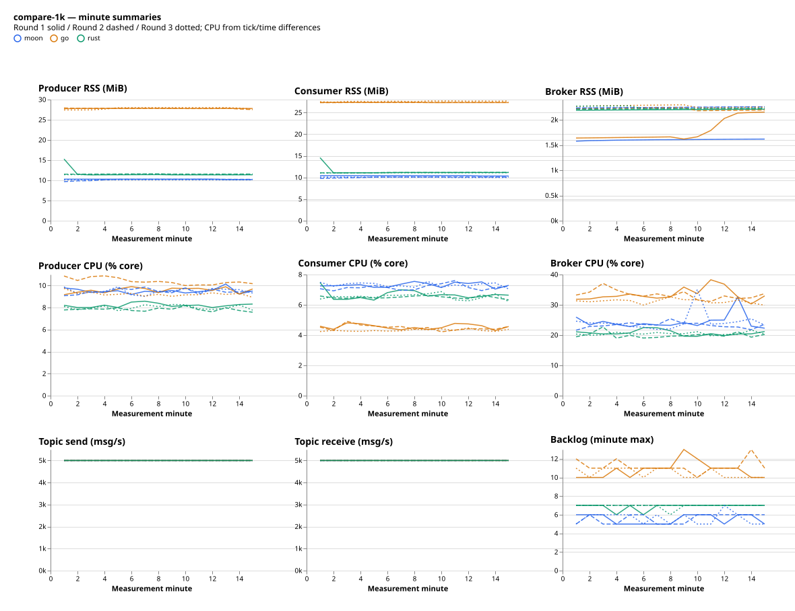
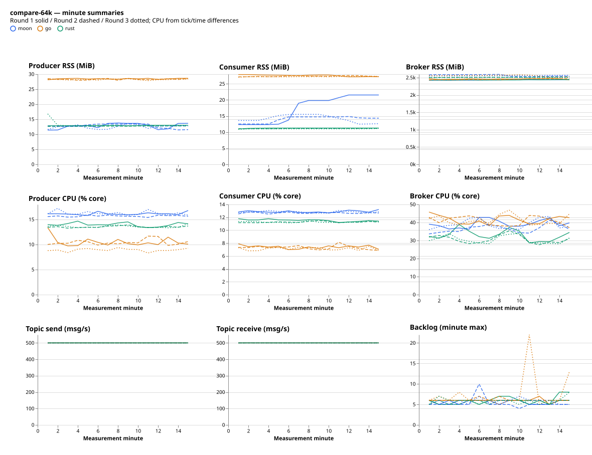
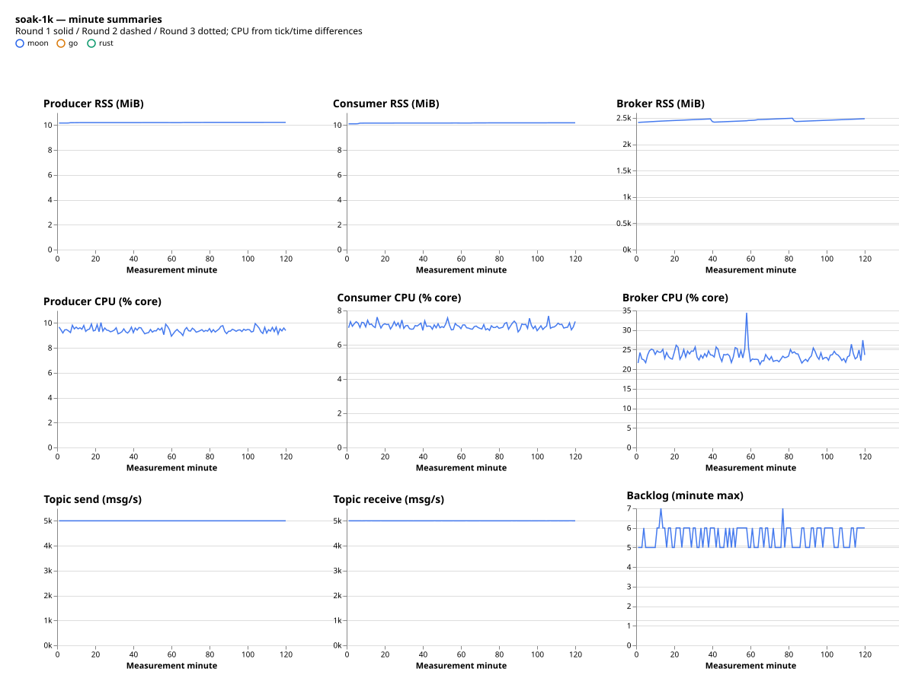

# 三客户端持续负载性能对比（第三批，已完成）

2026-09-28 16:37 至 2026-09-29 00:08（北京时间），完成 12 组预检、18 组正式对照及 MoonPulsar 两小时长稳。**本次共同负载下，MoonPulsar 的生产者内存占用最低；Go 的发送确认 P99 最低，且 64 KiB CPU 开销更低。MoonPulsar 并非所有指标都领先。**

## 三客户端对比

以下为三轮中位数。CPU 的 100% 代表一个逻辑核，RSS 为各轮进程峰值的中位数。

| 场景 / 指标 | MoonPulsar | Go | Rust |
| --- | ---: | ---: | ---: |
| 1 KiB 发送 msg/s | 4,999.99 | 4,999.99 | 4,999.98 |
| 1 KiB 发送确认 P99 ms | 3.40 | 3.10 | 4.50 |
| 1 KiB 生产者峰值 RSS MiB | 10.15 | 27.80 | 15.27 |
| 1 KiB 消费者峰值 RSS MiB | 9.99 | 27.24 | 14.97 |
| 1 KiB 生产者 / 消费者 CPU % | 9.50 / 7.31 | 9.59 / 4.49 | 8.01 / 6.54 |
| 64 KiB 发送 msg/s | 500.00 | 500.00 | 500.00 |
| 64 KiB 发送确认 P99 ms | 4.10 | 3.80 | 5.20 |
| 64 KiB 生产者峰值 RSS MiB | 13.69 | 33.23 | 16.58 |
| 64 KiB 消费者峰值 RSS MiB | 15.33 | 34.65 | 14.88 |
| 64 KiB 生产者 / 消费者 CPU % | 16.14 / 12.84 | 10.45 / 7.32 | 13.60 / 11.28 |

消费吞吐、三轮最小—最大范围及全部差异比例见 [详细对照表](tables.md) 和 [汇总 JSON](summary.json)。差异按 `(MoonPulsar / 参考客户端 − 1) × 100%` 计算，负值表示更低，CPU 差异为相对百分比而非百分点。

- **相对 Go**：MoonPulsar 生产者峰值 RSS 在 1 KiB / 64 KiB 下分别低 63.50% / 58.81%，消费者低 63.32% / 55.75%；P99 高 9.68% / 7.89%。64 KiB 生产者 CPU 高 54.35%、消费者高 75.47%；1 KiB 生产者 CPU 接近，消费者 CPU 高 62.89%。
- **相对 Rust**：MoonPulsar 生产者峰值 RSS 低 33.54% / 17.44%，P99 低 24.44% / 21.15%，生产者 CPU 高约 19%。64 KiB 消费者峰值 RSS 中位数高 3.05%，不能概括为所有角色内存都最低。
- 三方均维持共同目标速率。吞吐相近是限速设计的结果，**不能用于最大容量排名**。三轮范围不是置信区间，微小差异不代表统计显著。

## 配置与统计口径

Pulsar 4.2.4 standalone，共享 Linux x86_64 主机、24 vCPU / 16 GiB，客户端与 Broker 同机。受测 MoonPulsar 为 `8b4eeb6` 对应 RSS 修复版，Go `a83c151`、Rust `929bc54` 参考适配器使用固定 release 二进制。各组二进制指纹一致，见 [SHA256](binary-sha256.json)；不代表工作区最新提交已受测。

1 KiB 目标 5,000 msg/s，64 KiB 目标 500 msg/s；每客户端每大小三轮，串行执行并轮换次序。生产者每组预热 120 秒、测量 900 秒；消费者提前 2 秒启动、预热 124 秒、测量 897 秒。并发 32、batch 最多 100 条 / 128 KiB / 1 ms、队列 1000、发送超时 10 秒；无压缩和 TLS。收发各固定一个逻辑核，Go GOMAXPROCS=1，Rust 单线程 Tokio。相同配置不保证各库实际封包策略相同。

吞吐来自各自测量窗口；P99 为各轮整体发送确认 P99 的汇总，不是合并直方图 P99 或端到端消费延迟。峰值 RSS 来自 GNU time，包含预热和连接；收发峰值未必同时发生。趋势来自每秒 `/proc` VmRSS，与 GNU time 是不同统计口径，可能出现小幅不一致。

CPU 按 CPU ticks 差值除以 CLK_TCK 和实际时间差计算，排除预热。资源分析共同窗口为采样起点后 125–1,015 秒，长稳为 125–7,315 秒，取窗口内真实首末采样。Topic 吞吐由累计收发差分计算。分钟图显示 RSS 均值、CPU 差分、Topic 吞吐和分钟内最大积压，不显示逐秒延迟。

## 资源趋势

同色表示同一客户端，实线/虚线/点线分别为三轮。各面板内共用尺度，纵轴从零开始。Broker 是独立进程，其 RSS 不计入客户端内存。

64 KiB 第一轮 MoonPulsar 消费者 RSS 在后半段明显上升，分钟均值由约 12 MiB 增至约 21 MiB，后两轮较低。这反映该场景的内存波动，不能用 1 KiB 长稳结果替代解释；目前没有分配或堆剖析证据，不能断言其来自泄漏或某种缓存。若进一步研究 RSS，应优先复现这一场景并区分活跃消息、暂存缓冲与分配器保留。

## MoonPulsar 两小时长稳

1 KiB、5,000 msg/s，预热后完整测量 7,200 秒。发送 **4,999.9992 msg/s**、消费 **4,999.9990 msg/s**，整体 P99 **3.4 ms**。共同分析窗口 Topic 收发均约 4,999.9984 msg/s；采样积压最高 7 条、最终为 0。

| 角色 | 首分钟平均 RSS MiB | 末分钟平均 RSS MiB | 窗口采样 RSS 范围 MiB | RSS 线性斜率 MiB/h | 平均 CPU % |
| --- | ---: | ---: | ---: | ---: | ---: |
| 生产者 | 10.164 | 10.219 | 10.164–10.219 | 0.018 | 9.43 |
| 消费者 | 10.102 | 10.184 | 10.102–10.184 | 0.023 | 7.10 |
| Broker | 2,413.41 | 2,483.90 | 2,412.75–2,498.27 | 16.63 | 23.58 |

客户端 RSS 在本次两小时窗口内变化很小，未见持续大量增长或持续积压。Broker 波动和首末差值较大；线性斜率仅描述本窗口，不能外推为泄漏速度。RSS 无法区分堆、缓存或换入页面，不能证明永不泄漏，也不能直接认定 Broker 泄漏。

## 证据核验与边界

31 组均重新核验：62 个收发进程及 62 个就绪收发进程正常退出、stderr 为空、就绪有实际消息、直方图无溢出、31 次 Topic 删除返回 204。共保留 26,050 条运行采样，序号连续，最大间隔小于 1.072 秒；18 组正式对照各 1,021 条，长稳 7,312 条。角色身份和共同窗口覆盖检查通过。服务正常退出、进程组为空，未发现遗留基准进程；原始证据已收回私有目录。

全部组达到参考目标：发送≥98%、消费≥95%、P99≤250 ms。目标只是结果标记，不单独中止整批；资源危险和证据失效仍会停止。[第一批](../2026-09-28-sustained/README.md)和[第二批](../2026-09-28-sustained-v2/README.md)的失败证据保留；本批成功不否定此前尾延迟异常。

19 个正式/长稳分析窗口内，主机可用内存最低约 10.74 GiB，累计换入 150,989 页、换出 12 页（不含窗口外时段）。长稳窗口换入 3,694 页、换出 0 页。共享主机存在旧交换页和运行顺序影响，Broker 也连续运行，因此各组缓存状态并非完全相同，对比结论只适用于本次条件。

优化重点应是 **64 KiB 收发 CPU** 和 **1 KiB 消费 CPU**：先剖析复制、编码/解码、分配和调度占比，再做同负载单变量 A/B。当前结果支持保留超时状态有界化，不支持盲目缩小队列以追求更低 RSS。最大容量需另做递增负载验证。

无逐秒 P99、消息唯一序号或故障注入，不声明零丢失、零重复或恢复能力。只有 MoonPulsar 执行两小时测试，不称为三方两小时长稳对照。

数据：[逐组结果](runs.json) · [汇总](summary.json) · [分钟趋势](resource-minutes.json) · [预检](prechecks.json) · [核验状态](status.json)。未自动提交或推送；本批结束后暂停自动跟进。
